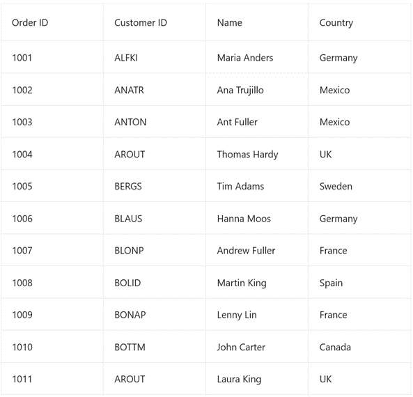

# how-to-bind-data-using-tool-kit-mvvm-in-maui-datagrid

The .NET [MAUI DataGrid](https://www.syncfusion.com/maui-controls/maui-datagrid)(SfDataGrid) allows you to work with the [CommunityToolkit](https://www.nuget.org/packages/CommunityToolkit.Mvvm) Mvvm framework. Please follow the steps below to work with the CommunityToolkit Mvvm,

Step 1: Install the [CommunityToolkit.Maui](https://www.nuget.org/packages/CommunityToolkit.Maui) and [CommunityToolkit.Mvvm](https://www.nuget.org/packages/CommunityToolkit.Mvvm) NuGet package in the project.
Step 2: Create a model class that inherit from ObservableObject and with annotation as ObservableProperty attribute.

```C#
public partial class OrderInfo : ObservableObject
{
    [ObservableProperty]
    public string orderID;
    [ObservableProperty]
    public string customerID;
    [ObservableProperty]
    public string customer;
    [ObservableProperty]
    public string shipCountry;
    [ObservableProperty]
    public string shipCity;

    public OrderInfo(string orderID, string customerID, string customer, string shipCountry, string shipCity)
    {
        OrderID = orderID;
        CustomerID = customerID;
        Customer = customer;
        ShipCountry = shipCountry;
        ShipCity = shipCity;
    }
}
```
Step 3:  Create a view model class that inherit from ObservableObject and with annotation as ObservableProperty attribute.

```C#
public partial class MainViewModel : ObservableObject
{
    [ObservableProperty]
    ObservableCollection<Model.OrderInfo> orders;

    public MainViewModel()
    {
        Orders = new ObservableCollection<Model.OrderInfo>();
        GenerateOrders();
    }

    public void GenerateOrders()
    {
        Orders.Add(new Model.OrderInfo("1001", "ALFKI", "Maria Anders", "Germany", "Berlin"));
        Orders.Add(new Model.OrderInfo("1002", "ANATR", "Ana Trujillo", "Mexico", "Mexico D.F."));
        Orders.Add(new Model.OrderInfo("1003", "ANTON", "Ant Fuller", "Mexico", "Mexico D.F."));
        Orders.Add(new Model.OrderInfo("1004", "AROUT", "Thomas Hardy", "UK", "London"));
        Orders.Add(new Model.OrderInfo("1005", "BERGS", "Tim Adams", "Sweden", "London"));
        Orders.Add(new Model.OrderInfo("1006", "BLAUS", "Hanna Moos", "Germany", "Mannheim"));
        Orders.Add(new Model.OrderInfo("1007", "BLONP", "Andrew Fuller", "France", "Strasbourg"));
        Orders.Add(new Model.OrderInfo("1008", "BOLID", "Martin King", "Spain", "Madrid"));
        Orders.Add(new Model.OrderInfo("1009", "BONAP", "Lenny Lin", "France", "Marsiella"));
        Orders.Add(new Model.OrderInfo("1010", "BOTTM", "John Carter", "Canada", "Lenny Lin"));
        Orders.Add(new Model.OrderInfo("1011", "AROUT", "Laura King", "UK", "London"));
        Orders.Add(new Model.OrderInfo("1012", "BLAUS", "Anne Wilson", "Germany", "Mannheim"));
        Orders.Add(new Model.OrderInfo("1013", "BLONP", "Martin King", "France", "Strasbourg"));
        Orders.Add(new Model.OrderInfo("1014", "AROUT", "Gina Irene", "UK", "London"));
    }
}
```
Step 3: Bind the ViewModel collection to the [SfDataGrid.ItemsSource](https://help.syncfusion.com/cr/maui/Syncfusion.Maui.DataGrid.SfDataGrid.html#Syncfusion_Maui_DataGrid_SfDataGrid_ItemsSource) property.
```XML
<ContentPage xmlns="http://schemas.microsoft.com/dotnet/2021/maui"
             xmlns:x="http://schemas.microsoft.com/winfx/2009/xaml"
             xmlns:syncfusion="clr-namespace:Syncfusion.Maui.DataGrid;assembly=SyncFusion.Maui.DataGrid"
             xmlns:vm="clr-namespace:SfDataGridDemoMVVM.ViewModel"
             x:Class="SfDataGridDemoMVVM.MainPage">
    <ContentPage.Content>
        <syncfusion:SfDataGrid x:Name="datagrid" ItemsSource="{Binding Orders}" HeaderGridLinesVisibility="Both" GridLinesVisibility="Both" AutoGenerateColumnsMode="None">

            <syncfusion:SfDataGrid.Columns>
                <syncfusion:DataGridTextColumn MappingName="OrderID"
                                               HeaderText="Order ID"></syncfusion:DataGridTextColumn>
                <syncfusion:DataGridTextColumn MappingName="CustomerID"
                                               HeaderText="Customer ID"></syncfusion:DataGridTextColumn>
                <syncfusion:DataGridTextColumn MappingName="Customer"
                                               HeaderText="Name"></syncfusion:DataGridTextColumn>
                <syncfusion:DataGridTextColumn MappingName="ShipCountry"
                                               HeaderText="Country"></syncfusion:DataGridTextColumn>
            </syncfusion:SfDataGrid.Columns>

        </syncfusion:SfDataGrid>
    </ContentPage.Content>
</ContentPage>
```
Step 4: Set BindingContext as MainViewModel for MainPage on its constructor.
```C#
public partial class MainPage : ContentPage
{
    public MainPage(MainViewModel viewModel)
    {
        InitializeComponent();
        BindingContext = viewModel;
    }
}

```
Step 5: Register the MainPage and MainViewModel as AddTransient to the MauiAppBuilder on MauiProgram.cs
```C#
public static MauiApp CreateMauiApp()
{
   var builder = MauiApp.CreateBuilder();
   builder
	.UseMauiApp<App>()
       .UseMauiCommunityToolkit()
       .ConfigureSyncfusionCore()
	.ConfigureFonts(fonts =>
	{
	    fonts.AddFont("OpenSans-Regular.ttf", "OpenSansRegular");
	    fonts.AddFont("OpenSans-Semibold.ttf", "OpenSansSemibold");
	});
    builder.Services.AddTransient<MainViewModel>();
    builder.Services.AddTransient<MainPage>();
	
    return builder.Build();
}
```
